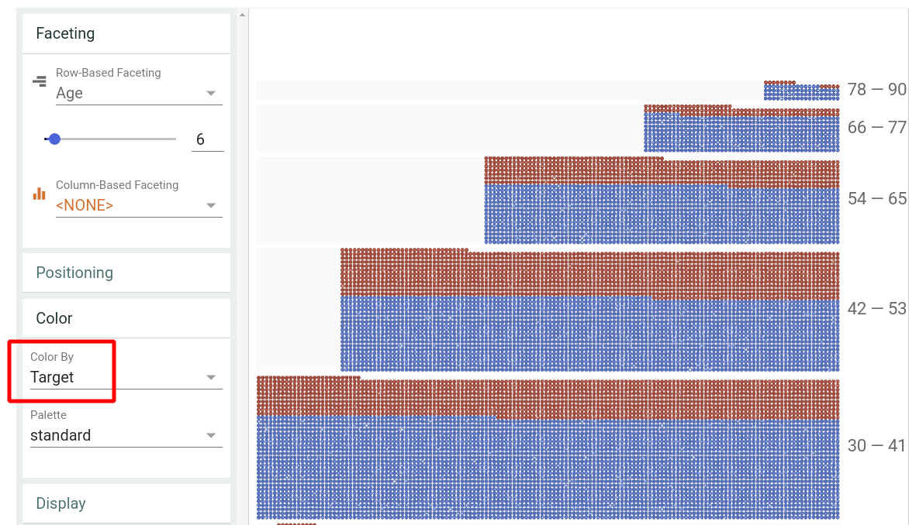
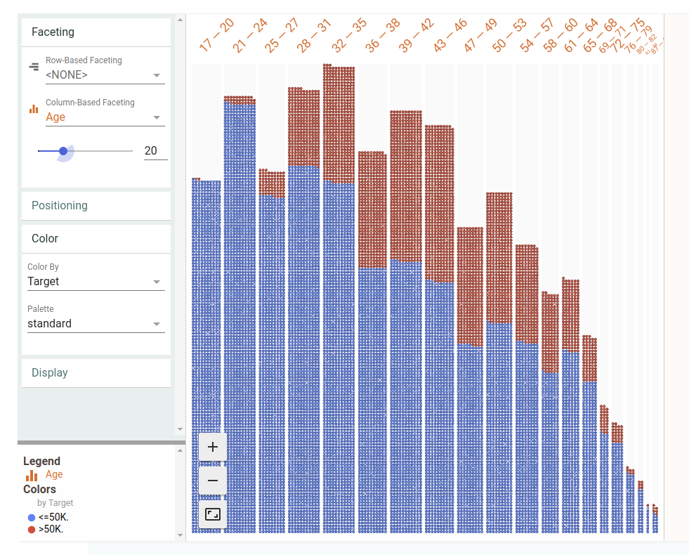
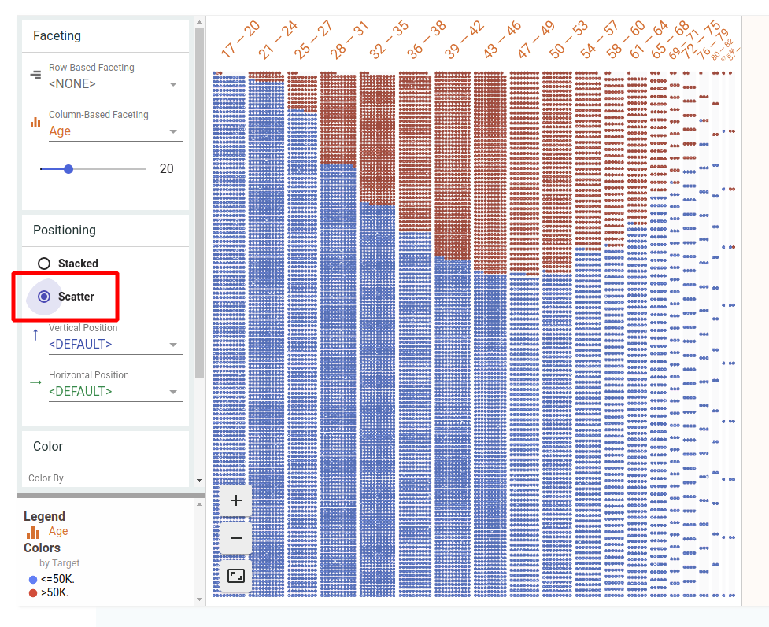

# Feature Engineering - Machine Learning Recipes #9

This is a more general video, and less of an actual hands-on.

The __Facets Dive__ tool & data may be visualized at the following [link](https://pair-code.github.io/facets/).

In order to have the same display as in the video, set __Color__ to __Color By target__ as shown:

There is also a very nice
[Jupyter notebook](https://github.com/random-forests/tensorflow-workshop/blob/master/examples/07_structured_data.ipynb)
which seems to be the last part of what looks like an interesting
[TensorFlow workshop](https://github.com/random-forests/tensorflow-workshop).

## Concepts Introduced

Introduces ___Bucketing___, ___Crossing___, ___Hashing___, and ___Embedding___.

#### Bucketing

Bucketing (also known as ___Binning___) is a way of segmenting a population, in this case by age.
If we switch from Row-Based Faceting to the more familiar Column-Based Faceting and set the Age
variable to 20, we end up with a histogram as follows:

If we switch the Positioning from Stacked to Scatter as shown, we get a normalized histogram:

#### Crossing

"Feature crossing is a way to create new features that are combinations of existing ones,
 and these can be especially helpful to linear classifiers, which can't model interactions
 between features."

    https://youtu.be/d12ra3b_M-0?list=PLOU2XLYxmsIIuiBfYad6rFYQU_jL2ryal&t=219

## Execution

To run, type the following:

    python feature_engineering.py

## Credits

    https://www.youtube.com/watch?v=d12ra3b_M-0
