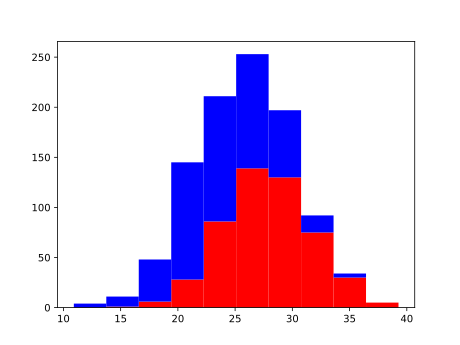

# Features - Machine Learning Recipes #3

Dive a little deeper into ML features with `numpy` and `matplotlib`.

## Execution

To run, type the following:

    python features.py

The results should be as follows:

    $ python features.py 
    $

The resulting graph should look like this:

An assumption was made that the height of each breed follows a __normal distribution__ (i.e. is __normally-distributed__).

## Credits

    https://www.youtube.com/watch?v=N9fDIAflCMY
