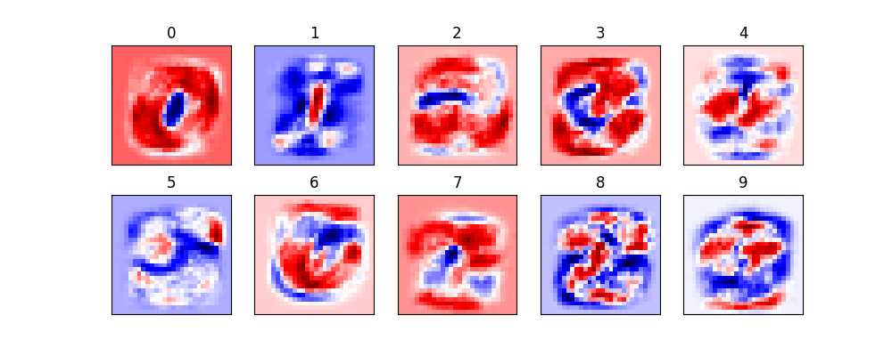
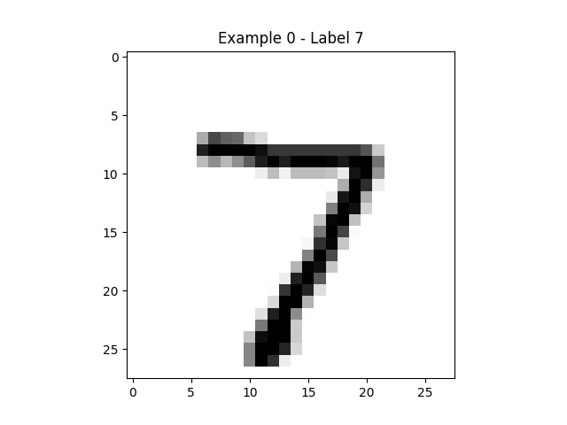
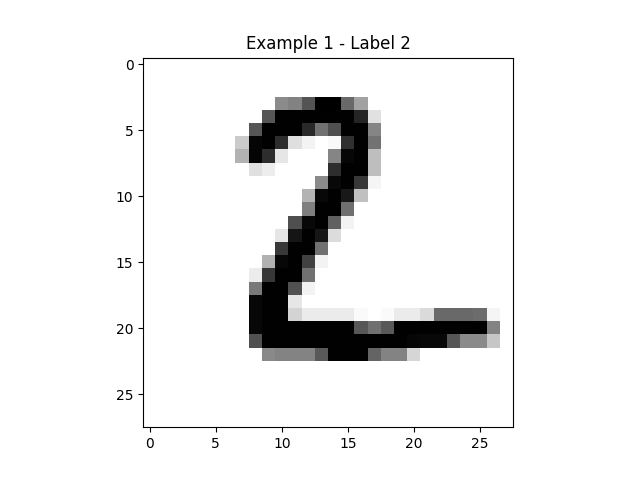
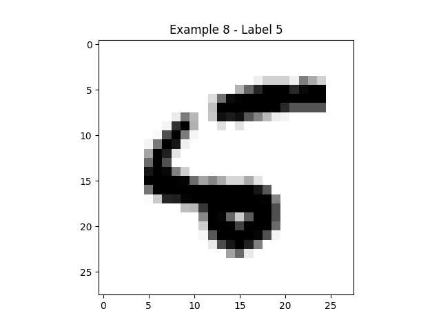
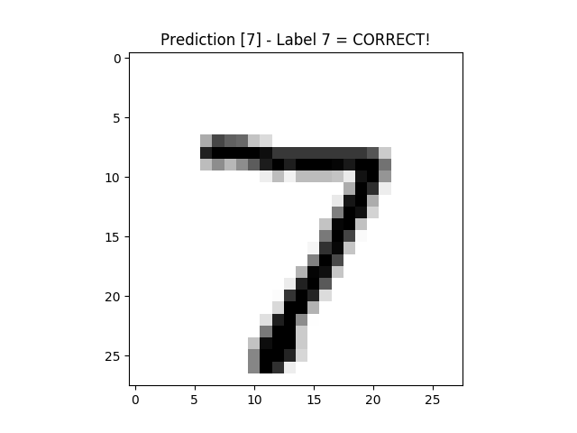
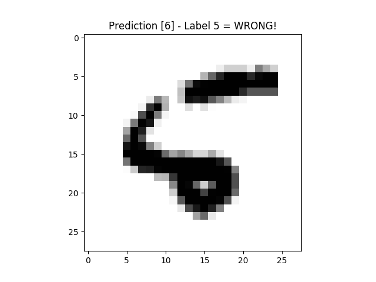

# Handwriting Classifier - Machine Learning Recipes #7

There are a wide variety of installation options for [TensorFlow](https://www.tensorflow.org/install/).

This video specifically deals with the [Docker](https://hub.docker.com/r/tensorflow/tensorflow/) option.

Note that, for GPU-based TensorFlow, there is also an [nvidia-docker](https://github.com/NVIDIA/nvidia-docker) option.

For more information, refer to the [TensorFlow layers](https://www.tensorflow.org/tutorials/layers) tutorial.

## MNIST Data

Like `sklearn` with its `load_iris()` convenience method, `TensorFlow` also has convenience methods
for the [MNIST dataset](http://yann.lecun.com/exdb/mnist/).

Run the following Python code to download it:

    import tensorflow as tf
    tf.logging.set_verbosity(tf.logging.ERROR)

    learn = tf.contrib.learn

    mnist = learn.datasets.load_dataset('mnist')

The results should look as follows:

    Successfully downloaded train-images-idx3-ubyte.gz 9912422 bytes.
    Extracting MNIST-data/train-images-idx3-ubyte.gz
    Successfully downloaded train-labels-idx1-ubyte.gz 28881 bytes.
    Extracting MNIST-data/train-labels-idx1-ubyte.gz
    Successfully downloaded t10k-images-idx3-ubyte.gz 1648877 bytes.
    Extracting MNIST-data/t10k-images-idx3-ubyte.gz
    Successfully downloaded t10k-labels-idx1-ubyte.gz 4542 bytes.
    Extracting MNIST-data/t10k-labels-idx1-ubyte.gz
    $

Now the MNIST data will be available for subsequent runs.

## Execution

Run the Python code as follows:

    $ python handwriting_classifier.py 

The results should look as follows:

    Extracting MNIST-data/train-images-idx3-ubyte.gz
    Extracting MNIST-data/train-labels-idx1-ubyte.gz
    Extracting MNIST-data/t10k-images-idx3-ubyte.gz
    Extracting MNIST-data/t10k-labels-idx1-ubyte.gz
    Features of each image (28x28) = 784
    Accuracy = 0.921599984169
    $

Note that the accuracy slightly exceeds the 0.9141 we were looking for.

#### Visualization

The visualized graphics were as follows:

#### Predicted

The prediction results were as follows:

## Credits

    https://www.youtube.com/watch?v=Gj0iyo265bc
