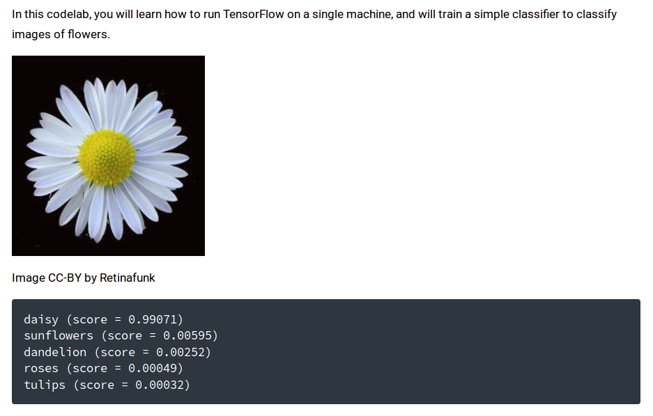

# Image Classifier (Deep Learning) - Machine Learning Recipes #6

Evaluating images with [TensorFlow](https://www.tensorflow.org/).

In this exercise we will try to replicate the above results.

[The recommendation is to have ~100 images per image category.]

For more details, refer to the
[TensorFlow for Poets](https://codelabs.developers.google.com/codelabs/tensorflow-for-poets/#0) codelab.

For the __Mobile__ version, refer to the
[TensorFlow for Poets 2: Optimize for Mobile](https://codelabs.developers.google.com/codelabs/tensorflow-for-poets-2/#0) codelab.

For the more recent __Mobile TFLite__ version, refer to the
[TensorFlow for Poets 2: TFLite](https://codelabs.developers.google.com/codelabs/tensorflow-for-poets-2-tflite/#0) codelab.

For even more details, refer to the
[TensorFlow Retraining](https://www.tensorflow.org/versions/master/tutorials/image_retraining) version.

__tl;dr__ The __TensorFlow__ (tf) components are pluggable and can be swapped-in, like __Scikit-Learn__ (sklearn) components.

## TensorFlow

#### Installation

Follow this [link](https://www.tensorflow.org/install/) for instructions on installing TensorFlow.

If you are using `pip` and already have TensorFlow installed, but wish to upgrade to the latest version:

    $ pip install --upgrade --user tensorflow

You should probably upgrade TensorBoard as well:

    $ pip install --upgrade --user tensorflow-tensorboard

#### Familiarization

We will need `retrain.py`. If you have not cloned the
[TensorFlow for Poets repo](https://github.com/googlecodelabs/tensorflow-for-poets-2), it is available from the
[TensorFlow repo](https://github.com/tensorflow/tensorflow/blob/master/tensorflow/examples/image_retraining/retrain.py).

As recommended, start off by running `retrain` to read (and hopefully understand) the help messages:

    $ python retrain.py -h

Depending on the TensorFlow options you have chosen, there may be problems importing `quant_ops`.
The following [link](https://petewarden.com/2016/05/03/how-to-quantize-neural-networks-with-tensorflow/)
may well be very helpful, and is probably worth scanning in any case. But, __TensorFlow for Poets__
does not actually use the troublesome quantization (it recommends `mobilenet_0.50_224` as opposed to
`mobilenet_0.50_224_quantized`), so all references to `quant_ops` may safely be commented out (lines
117, 783-784, 791-792, 801-808 inclusive) as follows:

	$ diff -uw retrain.py.orig retrain.py
	--- retrain.py.orig	2018-02-01 12:35:59.776185000 -0800
	+++ retrain.py	2018-02-01 13:25:51.315340991 -0800
	@@ -114,7 +114,7 @@
	 from six.moves import urllib
	 import tensorflow as tf
	 
	-from tensorflow.contrib.quantize.python import quant_ops
	+# from tensorflow.contrib.quantize.python import quant_ops
	 from tensorflow.python.framework import graph_util
	 from tensorflow.python.framework import tensor_shape
	 from tensorflow.python.platform import gfile
	@@ -780,16 +780,16 @@
	           [bottleneck_tensor_size, class_count], stddev=0.001)
	       layer_weights = tf.Variable(initial_value, name='final_weights')
	       if quantize_layer:
	-        quantized_layer_weights = quant_ops.MovingAvgQuantize(
	-            layer_weights, is_training=True)
	+#        quantized_layer_weights = quant_ops.MovingAvgQuantize(
	+#            layer_weights, is_training=True)
	         variable_summaries(quantized_layer_weights)
	 
	       variable_summaries(layer_weights)
	     with tf.name_scope('biases'):
	       layer_biases = tf.Variable(tf.zeros([class_count]), name='final_biases')
	       if quantize_layer:
	-        quantized_layer_biases = quant_ops.MovingAvgQuantize(
	-            layer_biases, is_training=True)
	+#        quantized_layer_biases = quant_ops.MovingAvgQuantize(
	+#            layer_biases, is_training=True)
	         variable_summaries(quantized_layer_biases)
	 
	       variable_summaries(layer_biases)
	@@ -798,14 +798,14 @@
	       if quantize_layer:
	         logits = tf.matmul(bottleneck_input,
	                            quantized_layer_weights) + quantized_layer_biases
	-        logits = quant_ops.MovingAvgQuantize(
	-            logits,
	-            init_min=-32.0,
	-            init_max=32.0,
	-            is_training=True,
	-            num_bits=8,
	-            narrow_range=False,
	-            ema_decay=0.5)
	+#        logits = quant_ops.MovingAvgQuantize(
	+#            logits,
	+#            init_min=-32.0,
	+#            init_max=32.0,
	+#            is_training=True,
	+#            num_bits=8,
	+#            narrow_range=False,
	+#            ema_decay=0.5)
	         tf.summary.histogram('pre_activations', logits)
	       else:
	         logits = tf.matmul(bottleneck_input, layer_weights) + layer_biases
	$

[My read on things is that quantization involves using 8-bit operations instead of floating-point.]

If you wish to compile `quant_ops` it is available from the
[TensorFlow repo](https://github.com/tensorflow/tensorflow/blob/master/tensorflow/contrib/quantize/python/quant_ops.py).

Once you have fixed (or not) any quantization issues, you should be presented with voluminous help.

## Training

There are two different models, four image sizes (we will use the largest: 224), four different
model sizes (we will use 50% as recommended) and two stepping options available (we will use the
smaller stepping [500] as recommended).

The plan is to start with the first model (MobileNet) and proceed to the second (Inception) if
the upgrade can be made without an unacceptable loss in execution time (on my machine it can).

#### TensorBoard

In a console window, launch `TensorBoard`:

    $ tensorboard --logdir training_summaries

This will open a dashboard that is available at:

    http://localhost:6006/

#### MobileNet Training

In a new console, type the following:

    $ IMAGE_SIZE=224
    $ ARCHITECTURE="mobilenet_0.50_${IMAGE_SIZE}"
    $ date && python retrain.py \
      --bottleneck_dir=bottlenecks \
      --how_many_training_steps=500 \
      --model_dir=models/ \
      --summaries_dir=training_summaries/"${ARCHITECTURE}" \
      --output_graph=retrained_graph.pb \
      --output_labels=retrained_labels.txt \
      --architecture="${ARCHITECTURE}" \
      --image_dir=flower_photos && date

The results (first run) should look something like:

    Thu Feb  1 15:08:26 PST 2018
    >> Downloading mobilenet_v1_0.50_224_frozen.tgz 100.1%
    Extracting file from  models/mobilenet_v1_0.50_224_frozen.tgz
    Model path:  models/mobilenet_v1_0.50_224/frozen_graph.pb
    INFO:tensorflow:Looking for images in 'sunflowers'
    INFO:tensorflow:Looking for images in 'dandelion'
    INFO:tensorflow:Looking for images in 'roses'
    INFO:tensorflow:Looking for images in 'tulips'
    INFO:tensorflow:Looking for images in 'daisy'
    ....
    INFO:tensorflow:Creating bottleneck at bottlenecks/tulips/490541142_c37e2b4191_n.jpg_mobilenet_0.50_224.txt
    INFO:tensorflow:Creating bottleneck at bottlenecks/tulips/303858799_942b9c09e7_m.jpg_mobilenet_0.50_224.txt
    ....
    INFO:tensorflow:2018-02-01 15:10:27.293320: Step 499: Cross entropy = 0.104326
    INFO:tensorflow:2018-02-01 15:10:27.314535: Step 499: Validation accuracy = 85.0% (N=100)
    INFO:tensorflow:Final test accuracy = 87.0% (N=353)
    INFO:tensorflow:Froze 2 variables.
    Converted 2 variables to const ops.
    Thu Feb  1 15:10:27 PST 2018
    $

Note that this first run downloaded `mobilenet_v1_0.50_224_frozen.tgz` (which will be available on subsequent runs).

[On my machine all of this took ~2 minutes to execute, which seems suspiciously fast.]

According to the __TensorFlow for Poets__ notes:

> This script downloads the pre-trained model, adds a new final layer,
>  and trains that layer on the flower photos you've downloaded.

A second run should look like:

	Thu Feb  1 16:02:15 PST 2018
	Not extracting or downloading files, model already present in disk
	Model path:  models/mobilenet_v1_0.50_224/frozen_graph.pb
	INFO:tensorflow:Looking for images in 'sunflowers'
	INFO:tensorflow:Looking for images in 'dandelion'
	INFO:tensorflow:Looking for images in 'roses'
	INFO:tensorflow:Looking for images in 'tulips'
	INFO:tensorflow:Looking for images in 'daisy'
	....
	INFO:tensorflow:2018-02-01 16:02:29.371780: Step 499: Validation accuracy = 88.0% (N=100)
	INFO:tensorflow:Final test accuracy = 87.8% (N=353)
	INFO:tensorflow:Froze 2 variables.
	Converted 2 variables to const ops.
	Thu Feb  1 16:02:29 PST 2018
	$

[Now less than a minute to execute, suspicious.]

#### Inception Training

In a new console, type the following:

    $ IMAGE_SIZE=224
    $ ARCHITECTURE="inception_v3_0.50_${IMAGE_SIZE}"

[This way we are comparing the same image size and model size as with MobileNet.]

The way to switch to the slower but more accurate Inception model (which is the default) is to
OMIT the `--architecture` tag:

    $ date && python retrain.py \
      --bottleneck_dir=bottlenecks \
      --how_many_training_steps=500 \
      --model_dir=models/ \
      --summaries_dir=training_summaries/"${ARCHITECTURE}" \
      --output_graph=retrained_graph.pb \
      --output_labels=retrained_labels.txt \
      --image_dir=flower_photos && date

The first run should look like:

    Thu Feb  1 16:33:11 PST 2018
    >> Downloading inception-2015-12-05.tgz 100.0%
    Extracting file from  models/inception-2015-12-05.tgz
    Model path:  models/classify_image_graph_def.pb
    INFO:tensorflow:Looking for images in 'sunflowers'
    INFO:tensorflow:Looking for images in 'dandelion'
    INFO:tensorflow:Looking for images in 'roses'
    INFO:tensorflow:Looking for images in 'tulips'
    INFO:tensorflow:Looking for images in 'daisy'
    ....
    INFO:tensorflow:2018-02-01 16:48:14.265575: Step 499: Validation accuracy = 90.0% (N=100)
    INFO:tensorflow:Final test accuracy = 90.4% (N=353)
    INFO:tensorflow:Froze 2 variables.
    Converted 2 variables to const ops.
    Thu Feb  1 16:48:14 PST 2018
    $

[About 15 minutes.]

The second run should look like:

    Thu Feb  1 16:52:49 PST 2018
    Not extracting or downloading files, model already present in disk
    Model path:  models/classify_image_graph_def.pb
    ....
    INFO:tensorflow:2018-02-01 16:53:16.729520: Step 499: Train accuracy = 84.0%
    INFO:tensorflow:2018-02-01 16:53:16.729645: Step 499: Cross entropy = 0.479270
    INFO:tensorflow:2018-02-01 16:53:16.771593: Step 499: Validation accuracy = 90.0% (N=100)
    INFO:tensorflow:Final test accuracy = 89.5% (N=353)
    INFO:tensorflow:Froze 2 variables.
    Converted 2 variables to const ops.
    Thu Feb  1 16:53:17 PST 2018
    $

[Less than a minute.]

Note that - at the cost of some execution time - this model is ~90% accurate, as contrasted with ~87.4% for MobileNet.

## Labelling

We will need `label_image.py`. If you have not cloned the
[TensorFlow for Poets repo](https://github.com/googlecodelabs/tensorflow-for-poets-2), it is available from the
[TensorFlow repo](https://github.com/tensorflow/tensorflow/blob/master/tensorflow/examples/label_image/label_image.py).

Be prepared for the following stack trace, which indicates that an input or an output layer
has been incorrectly specified:

    Traceback (most recent call last):
      File "label_image.py", line 129, in <module>
        input_operation = graph.get_operation_by_name(input_name)
      File "/home/owner/.local/lib/python2.7/site-packages/tensorflow/python/framework/ops.py", line 3451, in get_operation_by_name
        return self.as_graph_element(name, allow_tensor=False, allow_operation=True)
      File "/home/owner/.local/lib/python2.7/site-packages/tensorflow/python/framework/ops.py", line 3323, in as_graph_element
        return self._as_graph_element_locked(obj, allow_tensor, allow_operation)
      File "/home/owner/.local/lib/python2.7/site-packages/tensorflow/python/framework/ops.py", line 3383, in _as_graph_element_locked
        "graph." % repr(name))
    KeyError: "The name 'import/input' refers to an Operation not in the graph."

Either use the training console or open a new console and type the following:

    $ IMAGE_SIZE=224

#### MobileNet Labelling

Run `label_image` as follows (note the `--input_height` and `--input_width` parameters):

    $ python label_image.py \
        --graph=retrained_graph.pb --labels=retrained_labels.txt \
        --input_layer=input \
        --output_layer=final_result \
        --input_height=${IMAGE_SIZE} \
        --input_width=${IMAGE_SIZE} \
        --input_mean=128 --input_std=128 \
        --image=flower_photos/daisy/21652746_cc379e0eea_m.jpg

Failing to specify the `--input_height` and `--input_width` parameters will result in a stack trace like the following:

    Traceback (most recent call last):
      File "label_image.py", line 134, in <module>
        input_operation.outputs[0]: t
      File "/home/owner/.local/lib/python2.7/site-packages/tensorflow/python/client/session.py", line 895, in run
        run_metadata_ptr)
      File "/home/owner/.local/lib/python2.7/site-packages/tensorflow/python/client/session.py", line 1104, in _run
        % (np_val.shape, subfeed_t.name, str(subfeed_t.get_shape())))
    ValueError: Cannot feed value of shape (1, 299, 299, 3) for Tensor u'import/input:0', which has shape '(1, 224, 224, 3)'

The results should look as follows:

    daisy 0.9931763
    dandelion 0.004730663
    sunflowers 0.0020874038
    roses 5.105141e-06
    tulips 6.3175827e-07

Which is pretty close to what we are aiming for, bearing in mind this model is ~87.4% accurate.

#### Inception Labelling

Run `label_image` as follows (note the `--input_height` and `--input_width` parameters are not needed):

    $ python label_image.py \
        --graph=retrained_graph.pb --labels=retrained_labels.txt \
        --input_layer=Mul \
        --output_layer=final_result \
        --input_mean=128 --input_std=128 \
        --image=flower_photos/daisy/21652746_cc379e0eea_m.jpg

The results should look as follows:

    daisy 0.9878885
    sunflowers 0.009602106
    dandelion 0.0017036144
    tulips 0.000752518
    roses 5.3251228e-05

Very much the same as the MobileNet results!

## Credits

    https://www.youtube.com/watch?v=cSKfRcEDGUs
