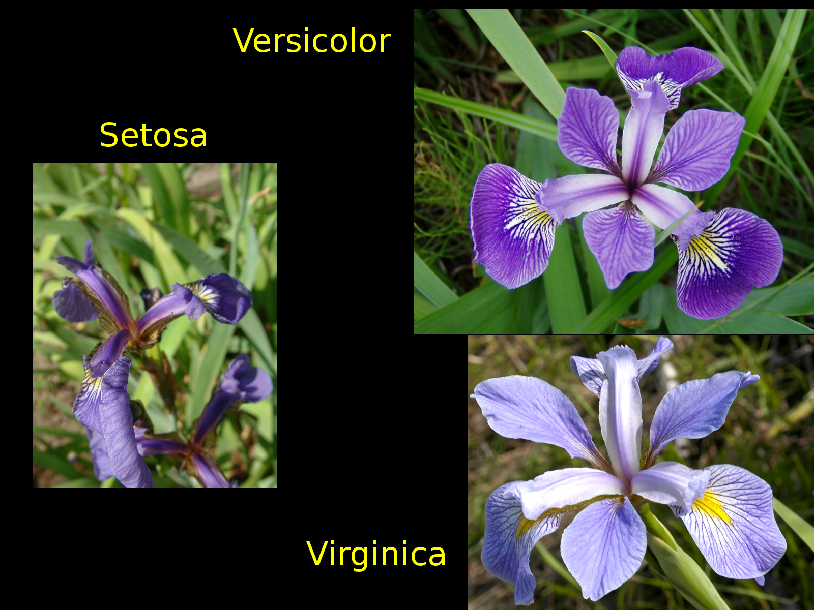

# Iris - Machine Learning Recipes #2

Dive a little deeper into ML classifiers with `sklearn` and [GraphViz](http://www.graphviz.org/).

[For a deeper dive into the Iris dataset, check out my [ML with SciPy](http://github.com/mramshaw/ML_with_SciPy) repo.]

__GraphViz__ is used to visualize the classifier (it's also great for visualizing MySQL databases).

Optionally, __pydot__ (__pydotplus__ if using __python3__) can be used to graph the data.

[This version uses command-line GraphViz via the `dot` command.]

## Execution

To run, type the following:

    python iris_classifier.py

The results should be as follows:

    $ python iris_classifier.py 
    Labelled:   [0 0 1 1 2 2]
    Classifier: [0 0 1 1 2 2]

    'IrisTree.dot' file created, use 'dot -Tsvg IrisTree.dot -O' to convert to SVG

    Features: ['sepal length (cm)', 'sepal width (cm)', 'petal length (cm)', 'petal width (cm)']
    Lables:   ['setosa' 'versicolor' 'virginica']

    Test [3]: 
    [ 6.4  3.2  4.5  1.5] 1
    $

To create an SVG of the decision tree DOT file:

    $ dot -Tsvg IrisTree.dot -O

The resulting graphic should look like this:

Note that the __left__ branch is always the __True__ path.

## Photo Credits

__Iris setosa__ courtesy Radomil:

    http://commons.wikimedia.org/wiki/File:Kosaciec_szczecinkowaty_Iris_setosa.jpg

__Iris versicolor__ courtesy Danielle Langlois:

    http://commons.wikimedia.org/wiki/File:Iris_versicolor_3.jpg

__Iris virginica__ courtesy Frank Mayfield:

    http://commons.wikimedia.org/wiki/File:Iris_virginica.jpg

## Credits

    http://www.youtube.com/watch?v=tNa99PG8hR8
