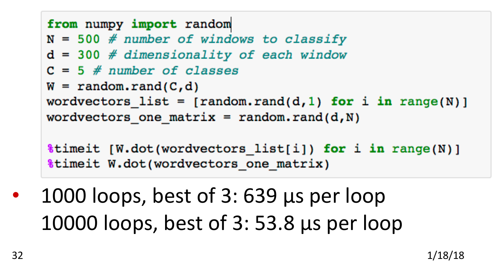

# Matrix Multiplication versus For Loops in IPython

A quick benchmark to compare matrix multiplication to for loops

## Requirements

* ipython

The '%' character indicates that the %timeit lines are __Magic__ commands, which is specific to __ipython__.

## Execution

Type in the command `ipython` then paste in the contents of `matmult_vs_forloop.py`. Type `quit` to terminate.

## Results

As always, benchmarks need to be verified.

I have no idea what hardware the initial benchmark was actually run on, but the results were as follows:

My results (which are quite a bit different), run on ___my___hardware, were as follows:

    In [11]: timeit [W.dot(wordvectors_list[i]) for i in range(N)]
    1000 loops, best of 3: 861 µs per loop
    
    In [12]: timeit W.dot(wordvectors_one_matrix)
    1000 loops, best of 3: 381 µs per loop

Still, as 381 is less than 861, the overall recommendation (use Matrix Multiplication) holds.

## Credits

This was from the Stanford Course CS224N:

    https://youtu.be/uc2_iwVqrRI?list=PL3FW7Lu3i5Jsnh1rnUwq_TcylNr7EkRe6&t=2113
