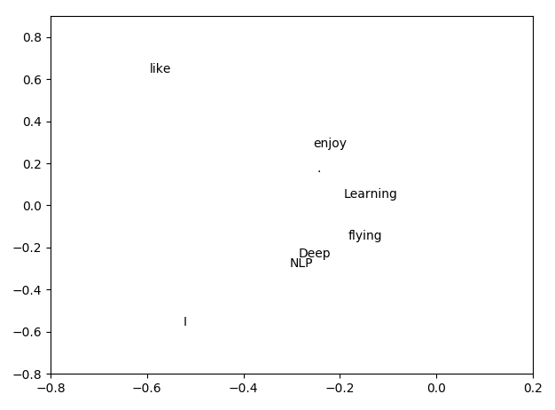

# Fun with Word Vectors

This is from 'Lecture 3: More Word Vectors' of Stanford's [Natural Language Processing with Deep Learning](http://web.stanford.edu/class/cs224n/).

Interestingly, the full-stop or period ('.') is treated as a word in its own right.

