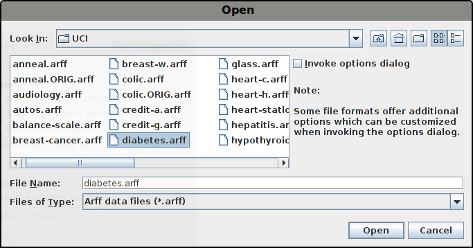
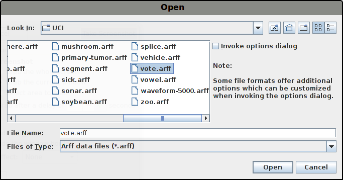

# WEKA - Machine Learning Recipes #10

Going old-school with ML and [WEKA](https://www.cs.waikato.ac.nz/ml/weka/).

WEKA is provided by the University of Waikato. Free courses here:

    https://www.cs.waikato.ac.nz/ml/weka/courses.html

It looks like WEKA is a great tool for preliminary investigation of a data set.

Even so, it does seem to offer advanced analytic tools as well.

## Installation

Download WEKA [here](https://www.cs.waikato.ac.nz/ml/weka/downloading.html)
(requires Java).

[If you are a linux user, make sure to download it from the site above, most
 linux software repositories have a _very_ old version of WEKA.]

Unzip the downloaded __.zip__ file.

## Execution

To run, change directory into the weka directory:

    $ java -jar weka.jar

#### Look and Feel

The settings menu (Program -> Settings) allows the setting of a Java look and feel.
Unfortunately the application needs to be restarted for this to take effect (as far
as I can remember, this is a Java limitation - without a work-around).

[I like the ___metal___ look and feel the best.]

## Data

Download `datasets-UCI.jar` from this page:

    https://www.cs.waikato.ac.nz/ml/weka/datasets.html

Extract it as follows:

    $ jar xvf datasets-UCI.jar 

Remove the manifest as follows:

    $ rm -rf META-INF/

#### Diabetes

Open the `diabetes.arff` file.

[Opening this file with a text editor shows attribution details.]

#### Vote

Open the `vote.arff` file.

[Here the visualizations make more sense: blue = democrat, red = republican.]

## TODO

- [ ] Fully understand the video

## Credits

    https://www.youtube.com/watch?v=TF1yh5PKaqI
